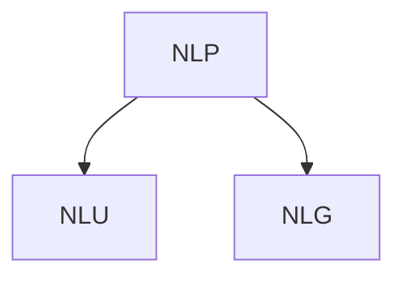

# About

Topics covered here are foundations for large language models (LLMs) or the popular Chatgpt. We focus on a sub branch of natural language processing (NLP), natural language understanding. 

This can even be dissected further as there are different layers to NLP that can be built on each other: lexical, syntactic, semantic, discourse layers. This analysis will primarily be a shallow. 

There are many horror movies, many which are unfortunately horrible. I use my NLP expertise for my analysis. Oh and if I didn't mention it already horror movies are my favorite movie genre. We will also use this same text to cluster movies by similarity. 

# General Prep

General data prep for NLP utilized in this repo includes:

 1 tokenization per word / unigrams

 2 removing stop words

 3 identifying parts of speech for each of these tokens such as adjective, noun, etc.

- _maxent_treebank_pos_tagger_ - Penn Treebank Tagset, which uses Penn Treebank corpus training on Wall Street Journal data

# Sentiment Analysis

Using our tokenized words and part of speech sets we tally negative and positive scores. We use scores associated with our words found in the SentiWordNet lexicon used for opinion mining. We supplement our tokens with synonyms for each of our tokens as there corresponding scores.

Adding score and overal verbal sentiment, e.g. positive or negative. We see that the Ghost Ship movie had a positive review, in this case anything with sentiment scores greater than or equal to zero are labelled as positive. This may not accurately represent how great the movie is, as this is only 1 review per movie. We could scape over hundreds of reviews per movie to make this even greater.

# Clustering

For the last section we use term frequency and apply weights to emphasize words unique to our movie reviews using TF-IDF. For clustering we use kmeans clustering to identify movies based on our features.

On average cluster 1 had higher positive sentiment scores. Common features that help contribute to this score are these movies are described as fun and have zombies. Cluster 5 on average had the lowest scores, with common features that include negative sentiment through words such as 'boring'. Overall there is positive sentiment for horror movies, but not exactly great films. Up next, lets find out what exactly is boring above these movies by using ngrams and chunkers.

